# AI Changelog Writer: Technical Stack Implementation Report

This report evaluates the current development status of the **AI Changelog Writer** project by comparing the active codebase against the specifications defined in [changelog_tech_stack.html](file:///c:/Users/hv081/OneDrive/Desktop/Code/changelog-writer/changelog_tech_stack.html).

---

## 📊 Executive Summary

The project is currently a highly functional **local prototype / end-to-end queue simulator (approx. 48% complete)**. 
- **Completed**: The core event queue (BullMQ + Redis), the local dev environments (Docker + Prisma), the AI classification pipeline (Groq/Llama), the core Next.js application routes (App Router, public pages, draft dashboard, and edit endpoints) are fully built and operational.
- **Pending**: The true live integrations (GitHub App registration, Webhook signatures, live Octokit diff fetching, NextAuth OAuth login, Tiptap rich-text editor setup, and email updates via Resend) are not yet implemented.

```mermaid
gantt
    title AI Changelog Writer Progress
    dateFormat  X
    axisFormat %d
    
    section Database & Local Dev
    Docker & Databases (Postgres/Redis)  :done, 0, 100
    Prisma Schema & Migrations          :active, 0, 85
    
    section Backend Worker
    BullMQ & Queue Processor             :done, 0, 100
    Octokit API Diffs Fetching           :crit, 0, 0
    
    section AI Layer
    JSON Parsing & Groq Integration      :done, 0, 90
    Context Truncation & Filters        : 0, 0
    
    section Frontend Pages
    App Router (Public/Admin Routes)     :done, 0, 100
    Draft Dashboard UI                   :active, 0, 85
    Tiptap Rich-Text Editor              : 0, 0
    NextAuth GitHub Login                : 0, 0
    
    section Integrations
    GitHub Webhooks & HMAC               : 0, 0
    Resend Email dispatch               : 0, 0
```

---

## 🔍 Detailed Component Status Breakdown

### 1. Frontend Layer (Dashboard & Public Pages)
| Feature | Target Stack Spec | Current Status | Notes / Location |
| :--- | :--- | :---: | :--- |
| **Next.js 14 App Router** | Public: `/[owner]/[repo]/page.tsx` Private: `/dashboard/page.tsx` | **100% Done** | Implemented file-based App routing perfectly. |
| **Server Components** | Fetch directly from Postgres in server components | **100% Done** | Data fetching in `/[owner]/[repo]/page.tsx` and `/dashboard/page.tsx` uses raw Prisma server-side calls without client fetchers. |
| **API Endpoints** | Webhooks + publish routes | **50% Partial** | Draft patching (`PATCH /api/entries/[id]`) and publishing (`POST /api/entries/[id]/publish`) are implemented. **Webhook receiver `/api/webhooks/github` is missing.** |
| **Tailwind CSS + UI** | CSS variables + shadcn/ui components | **75% Partial** | Tailwinds styles are active. Core components `Badge` and `Nav` exist, but standard shadcn/ui library primitives (Buttons, Cards, Forms) are styled ad-hoc. |
| **Tiptap Rich-Text Editor** | Renders a lightweight Notion-style editor | **0% Missing** | The code in [EditForm.tsx](file:///c:/Users/hv081/OneDrive/Desktop/Code/changelog-writer/app/dashboard/%5Bid%5D/edit/EditForm.tsx#L188-L194) currently uses a simple, plain HTML `<textarea>` with a basic regex Markdown previewer. |
| **NextAuth.js** | GitHub OAuth Login and protected dashboard | **0% Missing** | The package is installed, but no next-auth setup, route middleware protection, or OAuth API routing exist. |

---

### 2. Backend & Worker Layer
| Feature | Target Stack Spec | Current Status | Notes / Location |
| :--- | :--- | :---: | :--- |
| **Node.js Worker** | Standalone process on Railway | **100% Done** | Implemented as a separate process in [worker.ts](file:///c:/Users/hv081/OneDrive/Desktop/Code/changelog-writer/worker.ts) that handles background enqueued tasks. |
| **BullMQ & Redis** | Job queue with retries & deduplication | **100% Done** | Configured in [lib/queue/index.ts](file:///c:/Users/hv081/OneDrive/Desktop/Code/changelog-writer/lib/queue/index.ts) with exponential backoff (3 attempts, 5s delay), enqueuing on Redis. |
| **Octokit API** | Fetch PR details and diff files on event | **0% Missing** | The worker currently processes enqueued local mock payloads containing hardcoded `diffText` (see [test-queue.ts](file:///c:/Users/hv081/OneDrive/Desktop/Code/changelog-writer/scripts/test-queue.ts#L14)). Live API fetching using Octokit is not implemented. |

---

### 3. Database Layer
| Feature | Target Stack Spec | Current Status | Notes / Location |
| :--- | :--- | :---: | :--- |
| **PostgreSQL** | Five tables: `Installation`, `Repo`, `ChangelogEntry`, `Change`, and Session | **75% Partial** | Core domain schema is fully active (see [schema.prisma](file:///c:/Users/hv081/OneDrive/Desktop/Code/changelog-writer/prisma/schema.prisma)). NextAuth session schemas (`Account`, `Session`, `User`, `VerificationToken`) are missing. |
| **Prisma ORM** | Type safety and migrations | **100% Done** | Prisma is fully initialized, generated in `app/generated/prisma`, and active. |
| **Docker Compose** | Dockerized Postgres (5432) & Redis (6379) | **100% Done** | Fully operational in [docker-compose.yml](file:///c:/Users/hv081/OneDrive/Desktop/Code/changelog-writer/docker-compose.yml) for simplified one-command developer spin-up. |

---

### 4. AI & Classification Layer
| Feature | Target Stack Spec | Current Status | Notes / Location |
| :--- | :--- | :---: | :--- |
| **Claude (Anthropic)** | Swappable LLM that classifies changes | **90% Done** | Swapped to a highly efficient **Groq SDK + Llama 3.3 70B** model in [classifier.ts](file:///c:/Users/hv081/OneDrive/Desktop/Code/changelog-writer/lib/llm/classifier.ts). It generates structured JSON with type, semver suggestion, and summary. |
| **Context Management** | Truncate large diffs (12k limit) & ignore lockfiles | **0% Missing** | The classifier accepts raw, untruncated `diffText` strings without checking size thresholds or filtering out large noise files (such as `pnpm-lock.yaml`). |

---

### 5. Integrations & Infrastructure
| Feature | Target Stack Spec | Current Status | Notes / Location |
| :--- | :--- | :---: | :--- |
| **GitHub App & Webhooks** | HMAC signature verification & App credentials | **0% Missing** | The webhook route, HMAC signature check, and App integration keys are unimplemented. |
| **Resend (Emailing)** | Dispatch change summaries to email subscribers | **0% Missing** | No dispatch pipeline or subscription schemas are active. |
| **Vercel & Railway** | Host Next.js API + background queue worker | **0% Missing** | Currently running purely local on `localhost`. |

---

## 🛠️ Recommended Roadmap to 100% Completion

Here are the precise chronological milestones needed to take this project from a local queue simulator to a production-grade SaaS tool:

### ⚡ Phase 1: Interactive Dashboard (Core UX)
1. **Replace Textarea with Tiptap Editor**: Integrate `@tiptap/react` inside [EditForm.tsx](file:///c:/Users/hv081/OneDrive/Desktop/Code/changelog-writer/app/dashboard/%5Bid%5D/edit/EditForm.tsx) to provide a rich-text editing experience with markdown support.
2. **NextAuth.js Setup**: Add `/api/auth/[...nextauth]` routes, connect them to GitHub OAuth credentials, and protect `/dashboard` using Next.js Middleware. Expand `schema.prisma` with NextAuth user/session tables.

### 🔌 Phase 2: Live GitHub App Integration
1. **GitHub App Webhook Route**: Implement `/api/webhooks/github` verifying payloads with the `X-Hub-Signature-256` HMAC signature using a webhook secret.
2. **Octokit API integration inside Worker**: Rewrite the BullMQ worker task to take only a `prNumber`, `repo`, and `owner`. Inside the worker, use the GitHub App installation token to fetch the live PR details and diff text, then run the classifier.
3. **Context Truncation**: Write a utility in `lib/llm/classifier.ts` that filters out lockfiles, assets, and truncates the remaining diff to ~12k characters to avoid token overflows.

### 📧 Phase 3: Notifications & Cloud Deploy
1. **Resend Email System**: Add a subscription model for repositories, and call the Resend API when an entry transitions to `PUBLISHED` status.
2. **Production Deploy**: Connect the repo to Vercel for serverless hosting and Railway to run Postgres, Redis, and the background `npm run worker` process.
